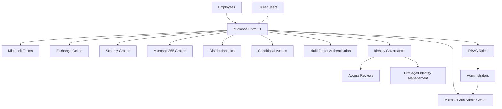

# Enterprise Identity Architecture
This is how identities flow through an enterprise Microsoft environment.

```mermaid
flowchart TD

    A[Employees] --> B[Microsoft Entra ID]

    B --> C[Microsoft 365 Admin Center]
    B --> D[Microsoft Teams]
    B --> E[Exchange Online]
    B --> F[Security Groups]
    B --> G[Microsoft 365 Groups]
    B --> H[Distribution Lists]

    I[Guest Users] --> B

    B --> J[Conditional Access]
    B --> K[Multi-Factor Authentication]
    B --> L[RBAC Roles]
    B --> M[Identity Governance]

    M --> N[Access Reviews]
    M --> O[Privileged Identity Management]

    L --> P[Administrators]

    P --> C
```
