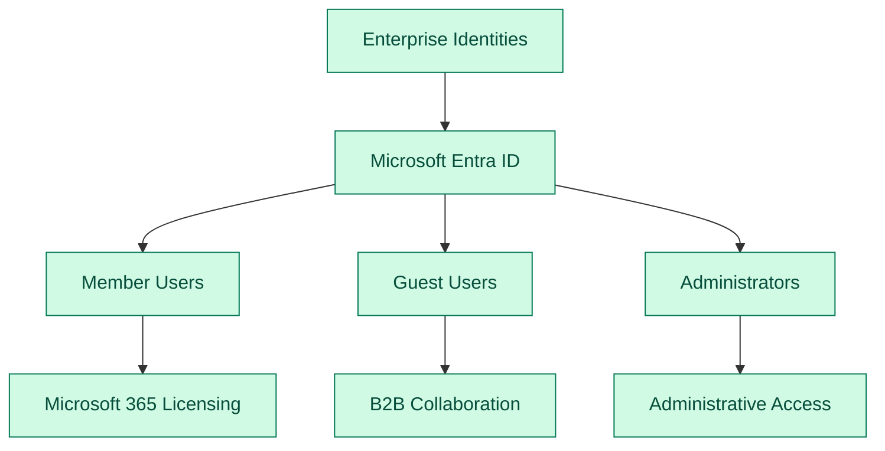
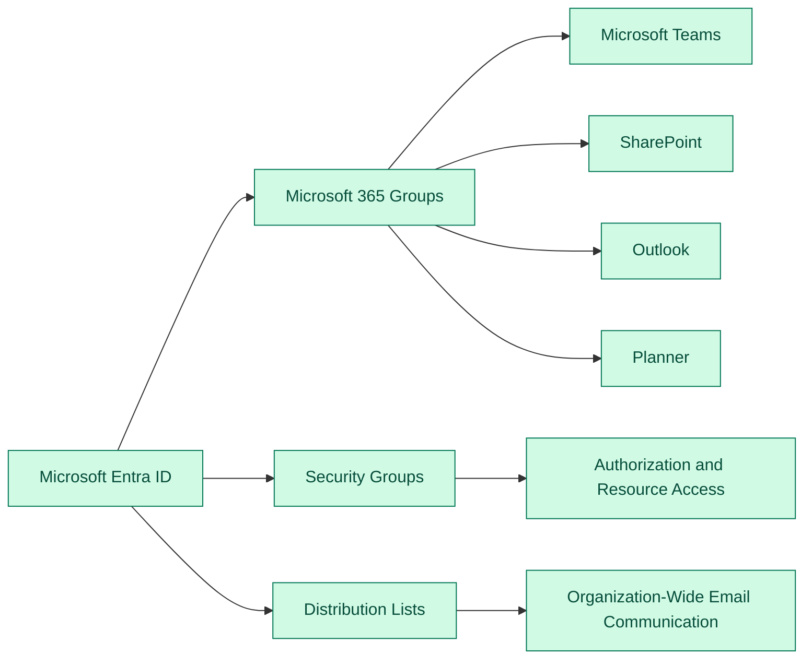
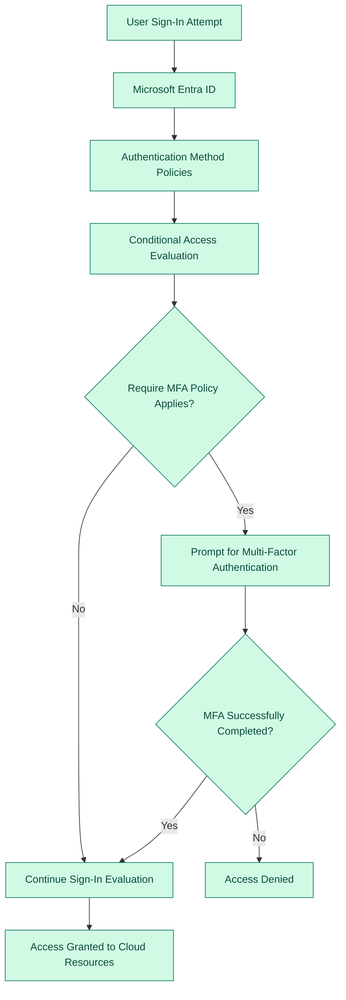
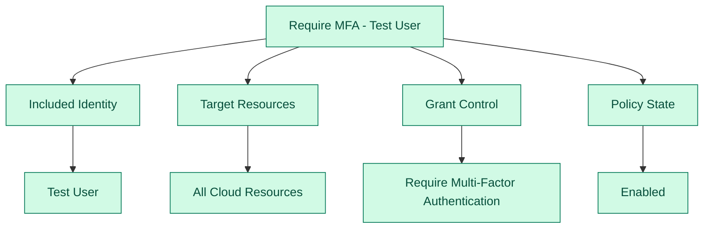
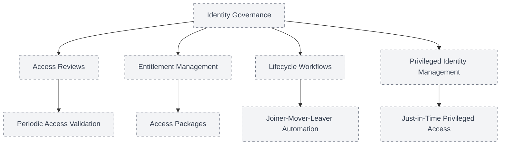
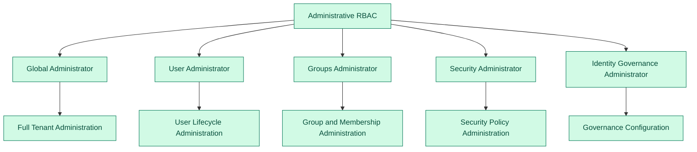
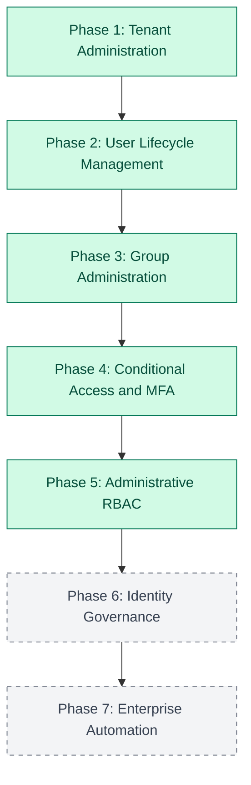

# Enterprise Microsoft Identity Platform

This architecture illustrates how identities are created, organized, secured, and governed within the fictional Kimble Glass Microsoft cloud environment.

---

## Identity Foundation

The identity foundation includes internal users, external guests, and administrators managed through Microsoft Entra ID.

---

## Collaboration and Access Resources

Microsoft 365 Groups support collaboration, Security Groups support authorization, and Distribution Lists support email communication.

---

## Identity Protection and Authentication Flow

The Phase 4 Conditional Access policy evaluates the Test User's sign-in and requires multifactor authentication before access to cloud resources is granted.

---

## Conditional Access Policy Scope

The custom policy is scoped to one test identity, applies to all cloud resources, and requires multifactor authentication.

---

## Identity Governance Roadmap

These identity governance capabilities are planned for future implementation phases.

---

## Administrative Role-Based Access Control

Administrative roles will be implemented using least privilege so administrators receive only the permissions required for their responsibilities.

---

## Implementation Status

**Completed:** Tenant administration, user provisioning, group administration, guest collaboration, authentication method review, Conditional Access, and MFA enforcement.

**Planned:** Administrative RBAC, identity governance, privileged access, lifecycle automation, PowerShell, and Microsoft Graph.
